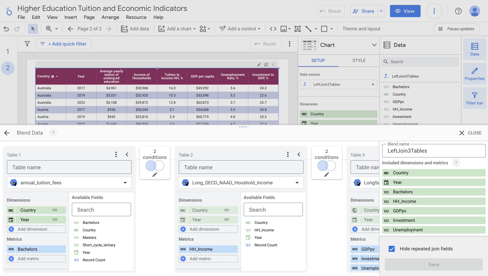
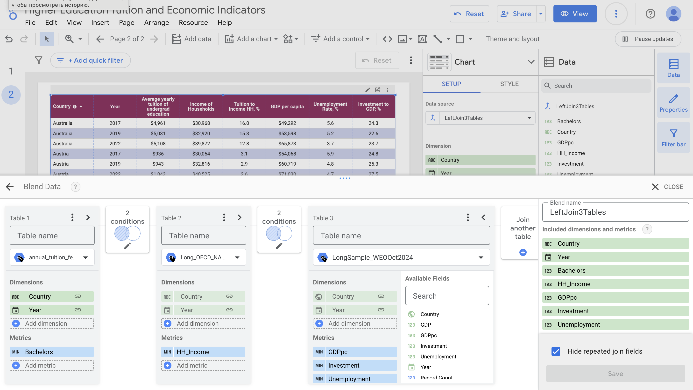

# Cross-Country Analytics: Higher Education Tuition and Economic Indicators
This project provides data and a Python notebook for creating a dataset in Google BigQuery, enabling its connection with Looker Studio for cross-country analysis of higher education tuition fees and key economic indicators.

[View the Project Dashboard](https://lookerstudio.google.com/s/iV0w5dVmWlI)

## Data and Sources
This project utilizes the following datasets:
1. **Annual Tuition Fees**
File: annual_tuition_fees.csv
- Description: Tuition for Public Institutions and the Average Tuition for Full-Time National Students.
- Source: *Education at a Glance 2020, 2022, 2024: OECD Indicators © OECD 2020, 2022, 2024.*
- Note: Tuition fees for Russia are calculated separately using PPP and the average market exchange rate of the national currency to USD and added to the table.
2. **Income of Households**
- File: OECD_NAAG_Houshold_Income_new.csv
- Description: Household income data.
- Source: *The National Accounts at a Glance (NAAG) Chapter 5: Households.*
3. Unemployment Rate & GDP per capita & Investment to GDP
- File: WEOOct2024all_prepr.csv
- Description: Data on unemployment rates and investment as a percentage of GDP.
- Source: *International Monetary Fund, World Economic Outlook Database, October 2024.*

## Setting Up the BigQuery Dataset
To create a dataset in **BigQuery** and enable API usage:
1. Log in to Google Cloud Console:
- Go to [Google Cloud Console](https://console.cloud.google.com/) and create a new BigQuery project.
2. Create a Service Account:
- Follow the guide to [create a service account](https://cloud.google.com/iam/docs/service-accounts-create).
3. Generate a Service Account Key:
- Learn how to [create service account keys](https://cloud.google.com/iam/docs/keys-create-delete).
4. Upload Data:
- Use the provided Python notebook to preprocess the data and upload it to your BigQuery project.

## Creating the Dashboard in Looker Studio
To visualize the data in **Looker Studio**:
1. Select Data Sources:
- Choose the three tables created in your BigQuery project as data sources.
2. Blend Tables:
- Use Left Joins to blend the data as shown in the pictures below:
- 
- 
3. Build Visualizations:
- Design charts, graphs, and other visualizations similar to those in this project or customize them to fit your needs.